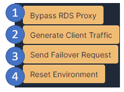
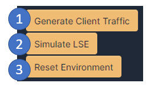

# Amazon Aurora PostgreSQL Fast Failover Demo

## A simple demonstration of in-region (HA) and cross-region (DR) failover automation using Amazon RDS Aurora PostgreSQL Global Database, RDS Proxy and Route53

## Cross-Region Recovery
- The CloudFormation template sets up a two-region database cluster for Diaster Recoveryand statically stable application routing to the local databse cluster.
- A Lambda canary process continually stans the primary region (every 10 seconds) from the secondary region, and enacts failover if it observes 30 seconds of consecutive failures.
 

## In-Region Recovery
- Each region also contains an RDS Proxy to provide High Availability transparent failover to the failved-over writer in the secondary Availability Zone.
- By queueing read and write queries until the reader instance comes back as a writer, RDS Proxy turns what would be SQL errors into a few extra seconds of latency for the application.

## Demos
- The repository also contains a test application to produce load for the application and log successful calls and errors in a simple UI, and times the failover
- In-region failover with and without RDS proxy

## Pre-Requisites
- A Public Hosted Zone registered with AWS Route53
	- If you don't have one, please follow [these instructions](https://aws.amazon.com/getting-started/hands-on/get-a-domain/) to create a new one
	- You can find the Public Hosted Zone ID in the AWS Console under Route53 -> Hosted Zones -> Hosted zone ID
	- You can find the Public Service FQDN in the AWS Console under Route53 -> Hosted Zones -> Hosted zone name
- Pick a unique-looking stack name (suggest all-caps with whole words describing what the stack does). These will become the prefix for all the resources the stack creates.
- Pick a database username and password you'd like the demo to use for the Aurora Postgres databases it creates. Please be aware that the password must be longer than 8 characters, and the username can't be a Postgres keyword (like "admin")
- Pick two AWS regions (example: us-east-1 and us-east-2) where you'll be testing
- Ensure that your Lambda concurrency is increased to at least 1000 in both test regions. In the AWS Console, navigate to: Service Quotas -> AWS services -> AWS Lambda -> Concurrent executions and click Request quota increase, selecting 1000. Do this in each test region.
- Optionally, you can specify the [CIDR blocks](https://en.wikipedia.org/wiki/Classless_Inter-Domain_Routing) (e.g. 10.10.0.0/21) for 2 VPCs and their subnets the solution will create
	- The template creates one VPC in the primary region and one in the secondary region
	- Each of the 2 VPCs the template will create will containin:
		- 2 public subnets (for the Internet-facing API we'll be calling to test the region's applicaion)
		- 2 private subnets (for the application's middle tier lambda)
		- 2 more private subnets (for the database instances the middle tier will write to)

## Deploying This Solution
- See pre-requisites section above, as you will be prompted for these by the next step
- This solution can be deployed using a single **main** CloudFormation template [located here](cloudformation/). Both main.yml and main.json are functionally identical. This template takes roughly 60 minutes to deploy.
- During deployment, this template will launch several additional multi-region CloudFormation StackSets to fully deploy the required resources. While you don't need to launch or modify these StackSets directly, the underlying templates have been included in this repo for your reference.
- The "Primary-Databases" substack step waits for RDS databases to come up in the failover region, so it could take >20m
- Once deployed, the primary stack you launch will contain the following outputs:
  - **InRegionFailoverDemoUrl** - The dashboard you can use to simulate an in-region failover.
  - **CrossRegionFailoverDemoUrl** - The dashboard you can use to simulate a cross-region failover.

- This template implements several mechanisms that may be useful to you outside of this use case. These mechanisms can be extracted from this repo and used elsewhere in your environment. These mechanisms include using CloudFormation to:
  - Empty an Amazon S3 bucket prior to deletion by CloudFormation.
  - Download code from a public repo URL and deploy it to Amazon S3.
  - Retrieve CloudFormation Exports from another AWS Region and use them as variables inside the invoking template.
  - Create a cross-region VPC Peering Connection and configure the required VPC routes on both sides.
  - Create a custom AWS Lambda Layer for Python runtimes. This tooling takes, as input, the PyPI packages you want included in the layer, as well as any custom functions, then returns the resulting Layer Version ARN for use elsewhere in your template(s).
  - Execute DDL statements against a remote database in need of configuration. In the case of this solution, this tooling is used to initialize an RDS Aurora PostgreSQL database. However, using the custom Lambda Layer creation tooling mentioned above, it could be easily modified to target additional DB engines (e.g., MySQL, MariaDB).
  - Delete some or all DNS records within an Amazon Route53 Hosted Zone during a CloudFormation Stack deletion. By default, CloudFormation's AWS::Route53::RecordSet[Group] resource handlers will NOT delete DNS records if they have a value different than that which was used at their creation. If your application modifies DNS records created by CloudFormation, CloudFormation will not delete them in an effort to protect customers from inadvertently deleting records that are still needed. The mechanism included in this solution is indiscriminate when it comes to deletion. It takes, as input, the FQDN(s) you would like deleted from the specified Hosted Zone and deletes those records, regardless of their current values.

## Running This Solution
- Once the above CloudFormation stack has completed:
- Test in-region failover using Amazon RDS Proxy:
	- Find the URLs of your test dashboard: Go to CloudFormation -> Stacks -> The stack you just created -> Outputs:
		- CrossRegionFailoverDemoUrl: https://dashboard.<FQDN>/cross-region-failover.html?apiHost=api.<FQDN>&primaryRegion=<REGION1>&failoverRegion=<REGION2>
		- InRegionFailoverDemoUrl: https://dashboard.<FQDN>/in-region-failover.html?apiHost=api.<FQDN>&primaryRegion=<REGION1>&failoverRegion=<REGION2>
	- Use the control panel in the top-left corner to run the test:
		- 
		- 1: Bypass (or enable) RDS Proxy to see the difference in data loss with and without it
		- 2: Click "Generate Client Traffic" to begin the test.
		- Note the blue line whihc measures successful requests
		- 3: Click "Send Failover Resuest" to shut down the active Aurora writer instance, causing an outage until the Aurora reader instance in the secondary availability zone restarts as a writer. 
		- Note the red line that measures errors returned to the client and the outage duration with and without RDS Proxy
		- 4: Reset the test environment before switching RDS Proxy on or off or re-running the test.
- Test in-region failover using Amazon Aurora Global Database:
	- Navigate to https://dashboard.<your Public Service FQDN>/in-region-failover.html
		- 
		- 1: Click "Generate Client Traffic" to begin the test.
		- Note the blue line whihc measures successful requests
		- 2: Click "Simulate LSE" to shut down all network connectivity to the primary region's Aurora databases causing an outage of the whole region's test applications in this VPC.
		- Note the red line that measures errors returned to the client and the outage duration.
		- Wait until the Canary Lambda notices the region is unhealthy, the Aurora reader instance in the secondary region restarts as a writer, and the Route53 CNAME is redirected to the secondary region.
		- 3: Reset the test environment before re-running the test.

## Cleaning Up This Solution
- To clean up / undeploy this solution, simply delete the primary CloudFormation Stack you initially launched. The cleanup will take roughly 45 minutes.
- If you see a delete failure, retry it, without skipping any failed deletions.
- Sometimes ENIs take longer than expexted to delete, in which case you can delete them and the VPC manually, then retry the stack deletion.
- After the stack deletion is complete, you need to delete the IAM roles used to do the deletion. Navigate to IAM -> Roles and find the roles that have your stack name as the prefix

## Security

See [CONTRIBUTING](CONTRIBUTING.md#security-issue-notifications) for more information.

## License

This library is licensed under the MIT-0 License. See the LICENSE file.

Note that the Python code depends on, but does not include, the LGPL-3.0 licensed Psycopg PostgreSQL adapter.
